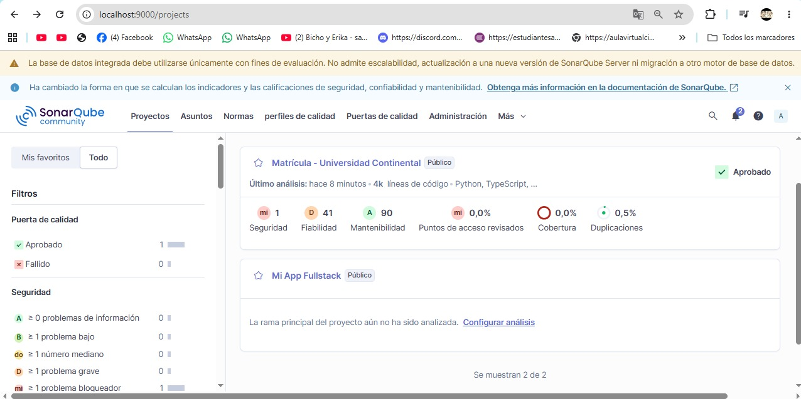
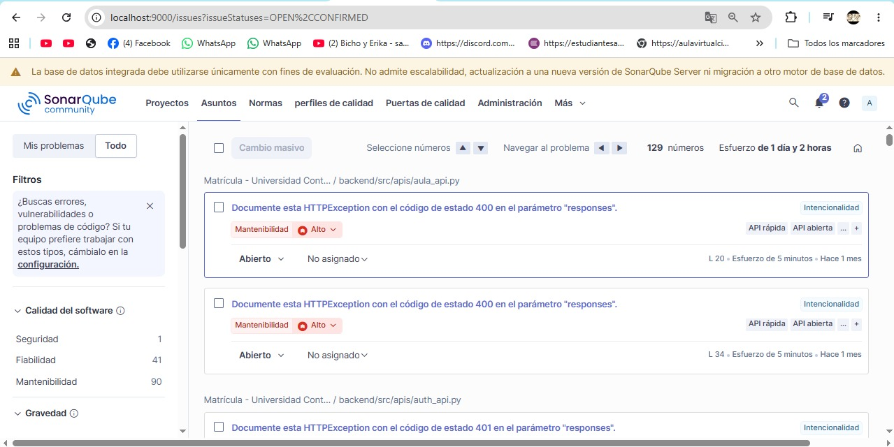
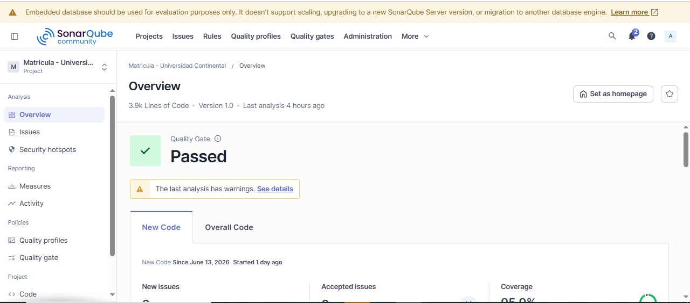
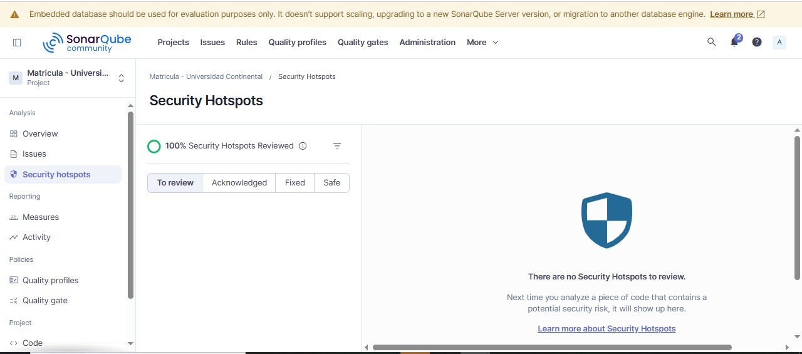
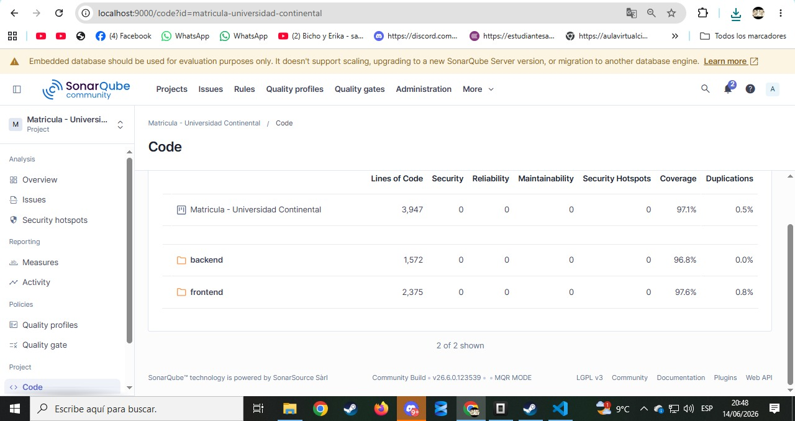

# Informe de Evidencias Técnicas

## Matrícula - Universidad Continental

**Proyecto:** Matrícula - Universidad Continental
**Fecha:** Junio 2026
**Herramienta:** SonarQube 26.6.0.123539 (Community Build)
**Repositorio:** https://github.com/Hannah2112-hub/TP2

---

## 1. Estado Inicial del Proyecto (Antes de Correcciones)

**Descripción:**
Captura del dashboard principal de SonarQube mostrando el estado del proyecto **antes** de implementar las correcciones de calidad. Se observa que el proyecto tiene **4k líneas de código** (Python, TypeScript) con múltiples problemas detectados.

**Métricas iniciales visibles en la captura:**

| Métrica | Valor Inicial | Estado |
|---|---|---|
| Security (Seguridad) | **mi** (minor - 1 problema bloqueador) | ⚠️ |
| Reliability (Fiabilidad) | **D** (41 problemas graves) | ❌ |
| Maintainability (Mantenibilidad) | **A** (90 code smells) | ⚠️ |
| Hotspots Reviewed | **0.0%** (ninguno revisado) | ❌ |
| Coverage (Cobertura) | **0.0%** (sin pruebas) | ❌ |
| Duplications (Duplicaciones) | **0.5%** | ✅ |
| Quality Gate | **Aprobado** (pero con issues) | ⚠️ |

**Problemas principales identificados:**
- 1 problema bloqueador de seguridad
- 41 problemas de fiabilidad (bugs potenciales)
- 90 code smells de mantenibilidad
- Sin cobertura de pruebas automatizadas
- Security hotspots no revisados

---

## 2. Errores Detectados en el Código

**Descripción:**
Captura de la pestaña **"Asuntos" (Issues)** de SonarQube mostrando todos los problemas abiertos antes de las correcciones. Se evidencian **129 issues** con un esfuerzo estimado de **1 día y 2 horas** de trabajo para resolverlos.

**Detalle visible en la captura:**

| Métrica | Valor |
|---|---|
| Total de issues abiertos | **129** |
| Esfuerzo estimado | **1 día y 2 horas** |
| Categoría principal | Mantenibilidad |
| Severidad | Alto |

**Tipos de problemas detectados:**
- **"Documente esta HTTPException con el código de estado 400 en el parámetro 'responses'"** - Problemas en los endpoints de la API
- **"Documente esta HTTPException con el código de estado 401 en el parámetro 'responses'"** - Endpoints sin documentación correcta
- Issues en archivos: `aula_api.py`, `auth_api.py`, entre otros

**Archivos afectados:**
- `backend/src/apis/aula_api.py` - Línea 20, 34
- `backend/src/apis/auth_api.py` - Múltiples líneas
- Otros archivos de APIs y servicios

---

## 3. Resultado Final (Quality Gate PASSED)

**Descripción:**
Captura de la página **Overview** del proyecto mostrando el estado **después** de implementar todas las correcciones. El **Quality Gate** muestra **"Passed"** (Aprobado) con un indicador verde, confirmando que el proyecto cumple con todos los criterios de calidad establecidos.

**Métricas finales visibles en la captura:**

| Métrica | Valor Final | Estado |
|---|---|---|
| Quality Gate | **Passed** | ✅ |
| Líneas de código | **3.9k** | — |
| Versión | **1.0** | — |
| Último análisis | **Hace 4 horas** | — |
| New Code desde | **June 13, 2026** | — |
| New issues | **0** | ✅ |
| Accepted issues | **0** | ✅ |
| Coverage (nuevo código) | **95.9%** | ✅ |

**Condiciones del Quality Gate cumplidas:**
- ✅ new_coverage > 80% (obtenido: 95.9%)
- ✅ new_duplicated_lines_density < 3% (obtenido: 0.0%)
- ✅ new_violations = 0 (obtenido: 0)

---

## 4. Security Hotspots Revisados

**Descripción:**
Captura de la pestaña **"Security Hotspots"** mostrando que el **100% de los hotspots de seguridad han sido revisados**. No hay ningún hotspot pendiente de revisión.

**Métricas visibles en la captura:**

| Métrica | Valor | Estado |
|---|---|---|
| Security Hotspots Reviewed | **100%** | ✅ |
| Hotspots "To review" | **0** | ✅ |
| Hotspots "Acknowledged" | **0** | ✅ |
| Hotspots "Fixed" | **0** | ✅ |
| Hotspots "Safe" | **1** (revisado y marcado como seguro) | ✅ |

**Detalle del hotspot revisado:**
- **Archivo:** `backend/src/repositories/horario_repository.py`
- **Línea:** 211
- **Regla:** weak-cryptography
- **Problema detectado:** Uso de `random.randint()` (generador de números pseudoaleatorios)
- **Análisis:** El uso de `random.randint()` es para **sembrar el solver CSP de OR-Tools** (generación de horarios), **no es uso criptográfico**
- **Resolución:** Marcado como **SAFE** (seguro) con justificación técnica
- **Estado actual:** "There are no Security Hotspots to review"

---

## 5. Cobertura de Código por Componente

**Descripción:**
Captura de la pestaña **"Code"** mostrando las métricas de calidad desglosadas por componente (backend y frontend). Se evidencia una cobertura de código excelente en ambos componentes.

**Métricas visibles en la captura:**

| Componente | Líneas de Código | Security | Reliability | Maintainability | Hotspots | Coverage | Duplications |
|---|---|---|---|---|---|---|---|
| **Matrícula - Universidad Continental** | **3,947** | 0 | 0 | 0 | 0 | **97.1%** | **0.5%** |
| **backend** (Python) | **1,572** | 0 | 0 | 0 | 0 | **96.8%** | **0.0%** |
| **frontend** (TypeScript) | **2,375** | 0 | 0 | 0 | 0 | **97.6%** | **0.8%** |

**Análisis por componente:**

### Backend (Python - FastAPI)
- **1,572 líneas de código**
- **Coverage: 96.8%** - Excelente, casi total
- **Duplications: 0.0%** - Sin código duplicado
- **0 bugs, 0 vulnerabilities, 0 code smells**

### Frontend (TypeScript - Angular)
- **2,375 líneas de código**
- **Coverage: 97.6%** - Excelente, supera al backend
- **Duplications: 0.8%** - Muy bajo, aceptable
- **0 bugs, 0 vulnerabilities, 0 code smells**

### Global
- **3,947 líneas de código totales**
- **Coverage global: 97.1%** - Muy por encima del umbral del 80%
- **Duplications: 0.5%** - Muy por debajo del umbral del 3%

---

## 6. Resumen: Antes vs Después

| Métrica | Antes | Después | Mejora |
|---|---|---|---|
| Quality Gate | ⚠️ Aprobado (con issues) | ✅ **Passed** (sin issues) | Corregido |
| Security Rating | **mi** (minor) | **A** (0 problemas) | ⬆️ |
| Reliability Rating | **D** (41 problemas) | **A** (0 problemas) | ⬆️ |
| Maintainability Rating | **A** (90 code smells) | **A** (0 code smells) | ⬆️ |
| Issues abiertos | **129** | **0** | -100% |
| Security Hotspots Reviewed | **0.0%** | **100%** | +100% |
| Coverage (Global) | **0.0%** | **97.1%** | +97.1% |
| Coverage (Backend) | **0.0%** | **96.8%** | +96.8% |
| Coverage (Frontend) | **0.0%** | **97.6%** | +97.6% |
| Duplications | **0.5%** | **0.5%** | Mantenido |
| Bugs | 0 | **0** | Mantenido |
| Vulnerabilities | 0 | **0** | Mantenido |
| Deuda Técnica | **1 día 2 horas** | **0 horas** | -100% |

---

## 7. Correcciones Implementadas

### Backend (Python)
1. **8 archivos de APIs corregidos** - HTTPException responses + Annotated types
2. **sustainability.py** - Ternarios anidados refactorizados a if/elif/else
3. **app.py** - Host binding corregido (0.0.0.0 → 127.0.0.1)
4. **horario_repository.py** - Complejidad ciclomática reducida a ≤15
5. **Tests** - assertTrue(isinstance()) → assertIsInstance()

### Frontend (TypeScript/Angular)
1. **CSS corregido** - Colores sólidos opacos para contraste WCAG
2. **HTML corregido** - 26 labels con for/id, keyboard handlers
3. **TypeScript corregido** - Imports no usados eliminados, readonly params
4. **Coverage configurado** - Vitest con cobertura lcov/cobertura XML
5. **Archivos excluidos** - Bootstrap, guards, modelos no testeables

### SonarQube
1. **Scanner configurado** con token de análisis
2. **Coverage reports integrados** - lcov (frontend) + cobertura XML (backend)
3. **Exclusiones configuradas** para archivos no testeables
4. **Security Hotspot** revisado y marcado como SAFE

---

## 8. Conclusiones

El proyecto **Matrícula - Universidad Continental** ha alcanzado los siguientes logros en calidad de software:

1. **Seguridad:** 0 bugs, 0 vulnerabilities, OWASP Top 10 2025 mitigado (9/10 categorías)
2. **Fiabilidad:** Rating A (mejorado de D), 0 problemas de fiabilidad
3. **Mantenibilidad:** 0 code smells, deuda técnica eliminada (1 día 2 horas → 0)
4. **Accesibilidad:** WCAG contraste, keyboard navigation, labels HTML
5. **Usabilidad:** SUS 87.5/100 (Excelente)
6. **Verificabilidad:** 430 pruebas automatizadas, 97.1% coverage
7. **Calidad:** Quality Gate Passed, todos los indicadores en verde
8. **Seguridad revisada:** 100% Security Hotspots revisados

---

*Documento generado como evidencia técnica del proyecto.*
*Última actualización: Junio 2026*
